# DSTFT, a learnable time-frequency layer
Differentiable short-time Fourier transform (DSTFT): Gradient-based parameters tuning for adaptive time-frequency representation.
DSTFT is a neural network layer whose weights are its parameters (i.e. window and hop lengths).

  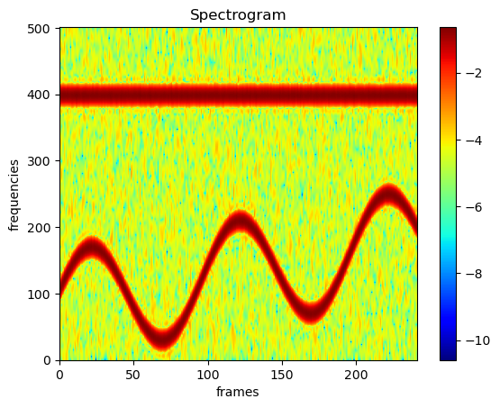
  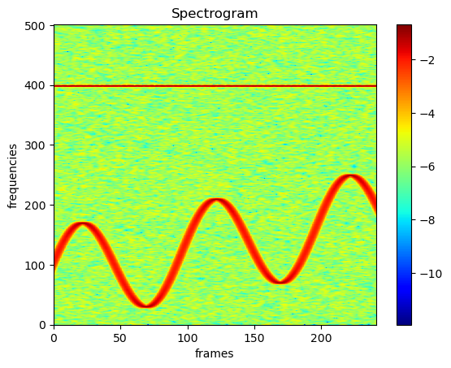 
  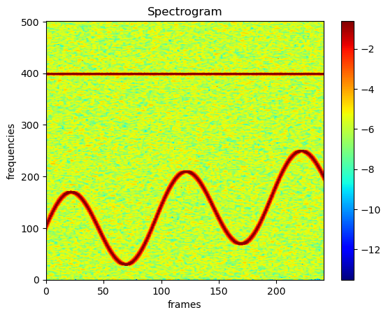
  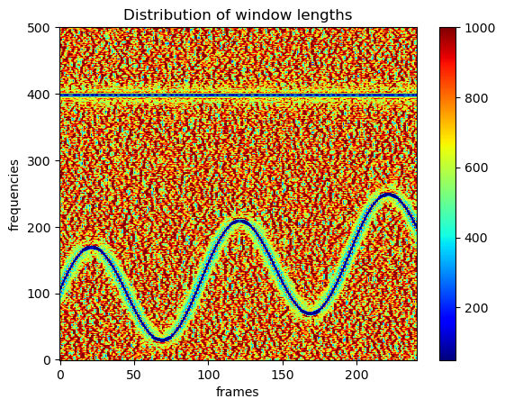 
  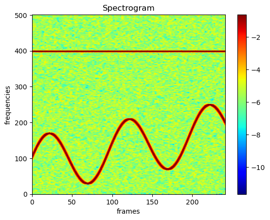
  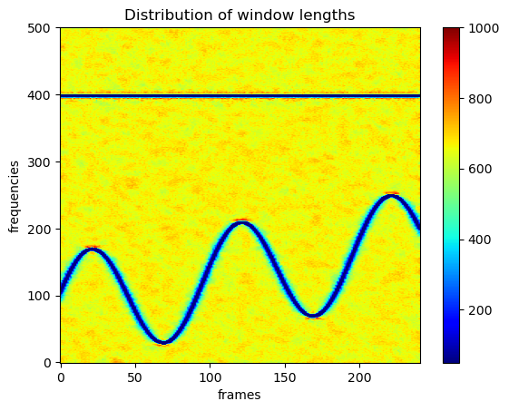 

  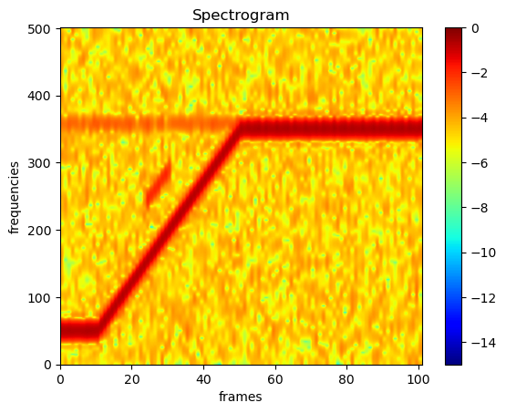
  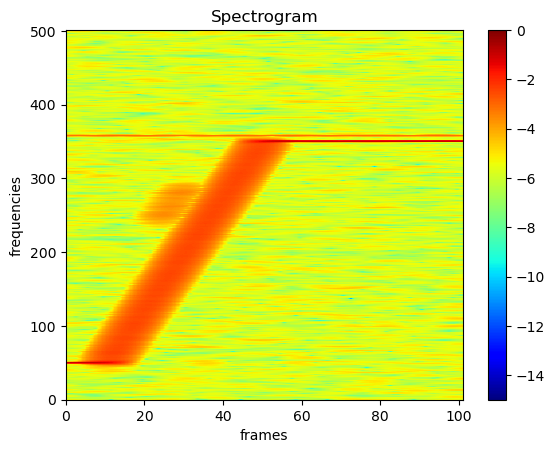 
  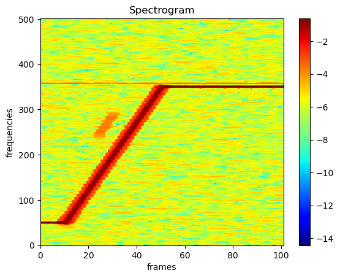
  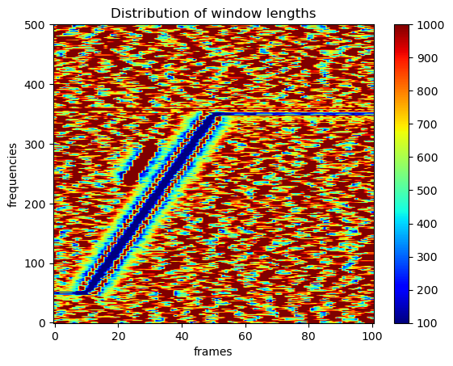 
  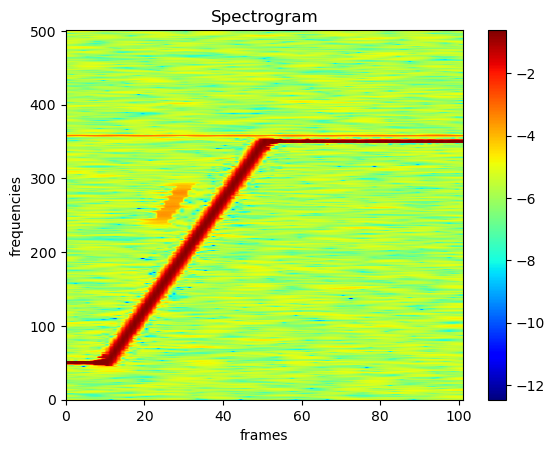
  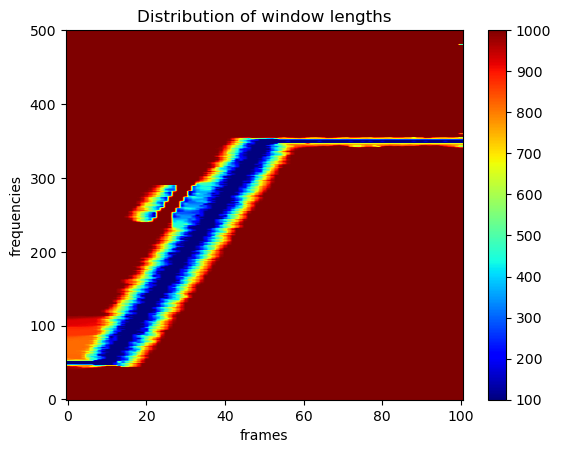 

  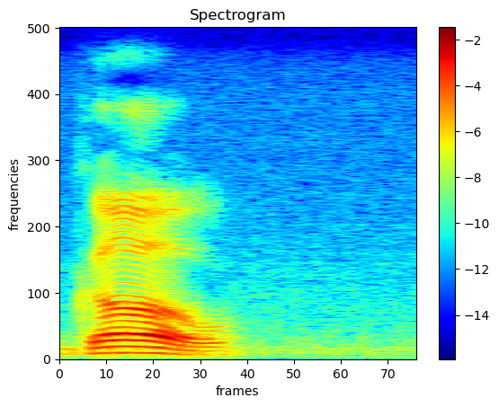
  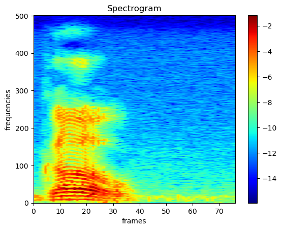 
  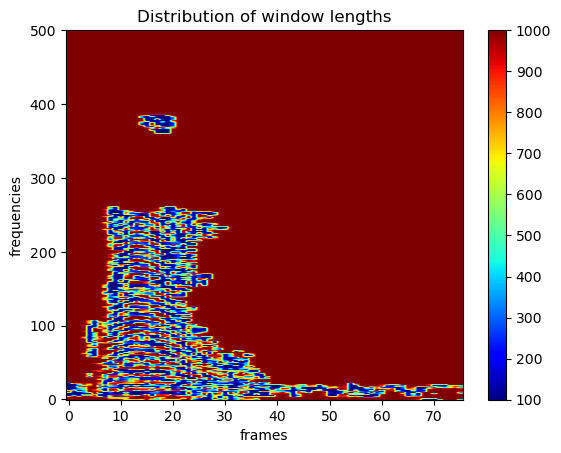

  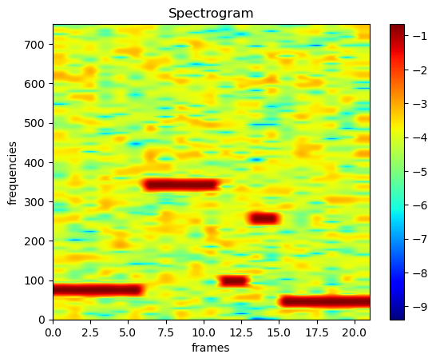
  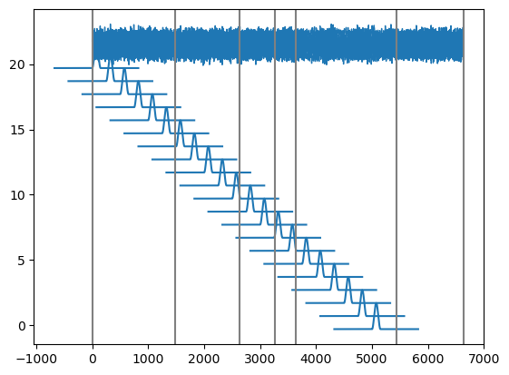 
  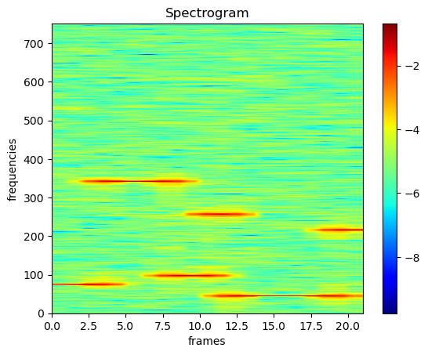
  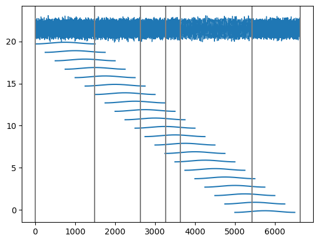 
  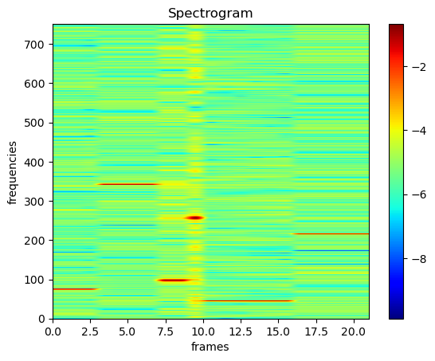
  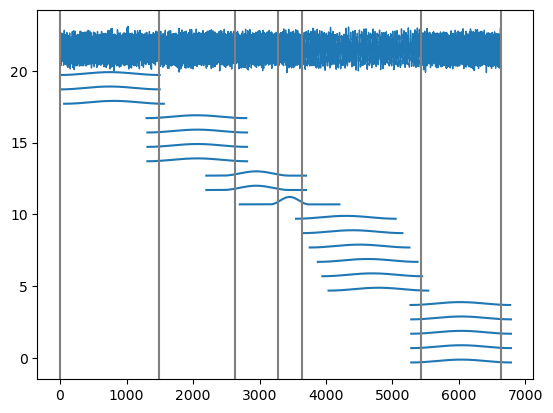 

  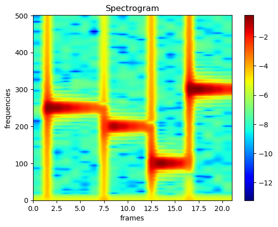
  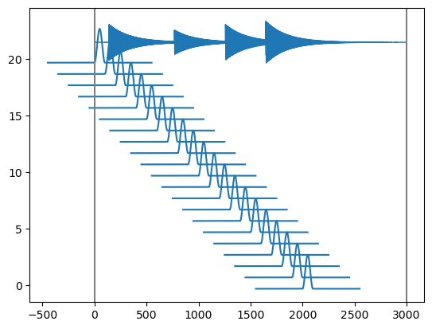 
  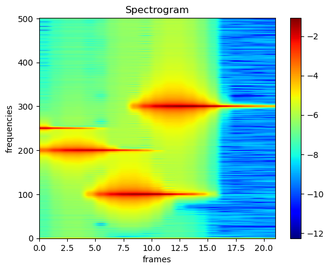
  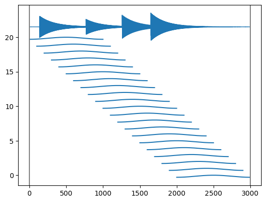 
  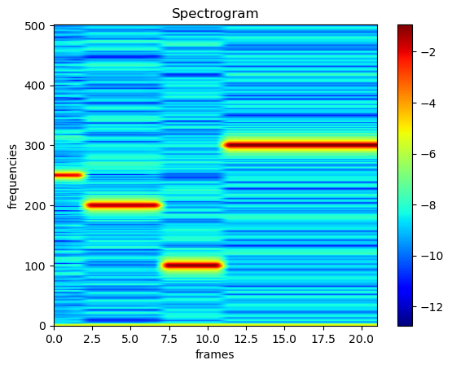
  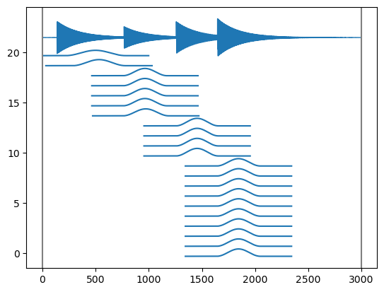 

